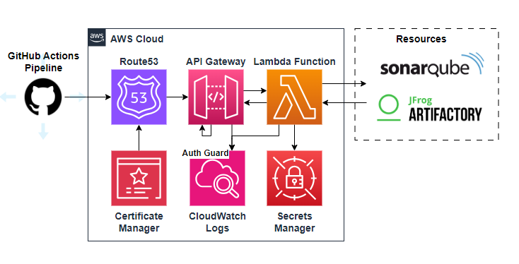

# Architecture

Autoken is deployed via AWS with the following infrastructure:

* **Route53 & Certificate Manager**: DNS & Certificate
* **API Gateway**: receives API requests
* **API Gateway Auth Guard**: valdiates JWT token from pipeline
* **Lambda**: processes requests
* **Secrets Manager**: securely stores secrets required to interact with the development platforms
* **CloudWatch**: stores logs for access requests and code execution results 
